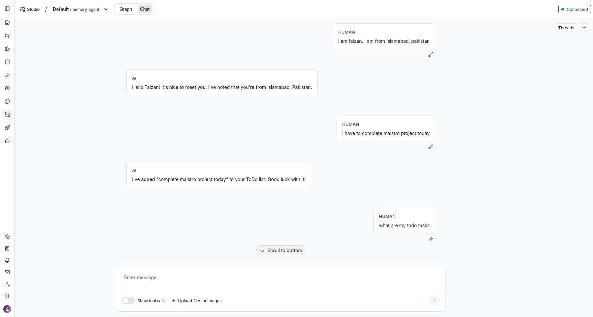

# **MAestro Memory Agent**

MAestro Memory Agent is an intelligent **memory-enabled chatbot** that uses both **Long-Term Memory (across checkpoints)** and **Short-Term Memory (within a single session)**.
Based on the user’s message, the agent decides whether to:

* **Update the user profile** (when the user shares factual details)
* **Add or update To-Do items**
* **Modify chatbot instructions** (when the user’s request affects behavior)

You can explore the full graph-based workflow in the diagram below:


---

## **Chatbot View**



---

## **Node Overview**

Here’s a simple explanation of each node:

* **start** – The entry point of the graph.
* **task_mAIstro** – The router node.
  It reads the user’s message and decides where to send the data next.
* **update_instruction** – Updates the agent’s internal instructions (e.g., “Always summarize my tasks.”)
* **update_profile** – Stores factual personal information shared by the user (e.g., “My birthday is June 5.”)
* **update_todo** – Adds or updates To-Do tasks (e.g., “Remind me to call the bank tomorrow.”)

---

## **Installation & Setup**

### **1. Create a virtual environment**

The project was tested using **Python 3.13.5**.

### **2. Install dependencies**

```bash
pip install -r requirements.txt
```

### **3. Start the LangGraph development server**

```bash
langgraph dev
```

### **4. Configure your API Key**

Create a `.env` file in the project’s root directory and add your Gemini API key:

```
GOOGLE_API_KEY="AI…"
```
---