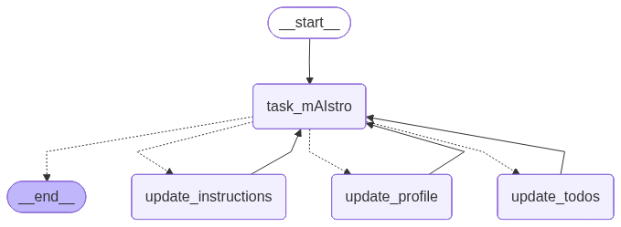

# MAestro Memory Agent
Built memory Agent utiizes both Long Term Memory (Memory across Checkpoints) and Short term memory. Based on user query it save information in User profile, TODOs or update Instruction. You can see graph structure in following images.  



**Nodes**:
- start: start node
- task_mAIstro: router node, select the next node based on user query.
- update_instruction: used to update todo instruction
- update_profile: when user share only factual information
- update_todo: when user share todo task.

## Installation and Setup
- Create virtual env, i tested using python version `3.13.5`
- install requirements
```
pip install -r requirements.txt
```
- create .env file in root directory and add Gemini API key here
```
GOOGLE_API_KEY = "AI...."
```